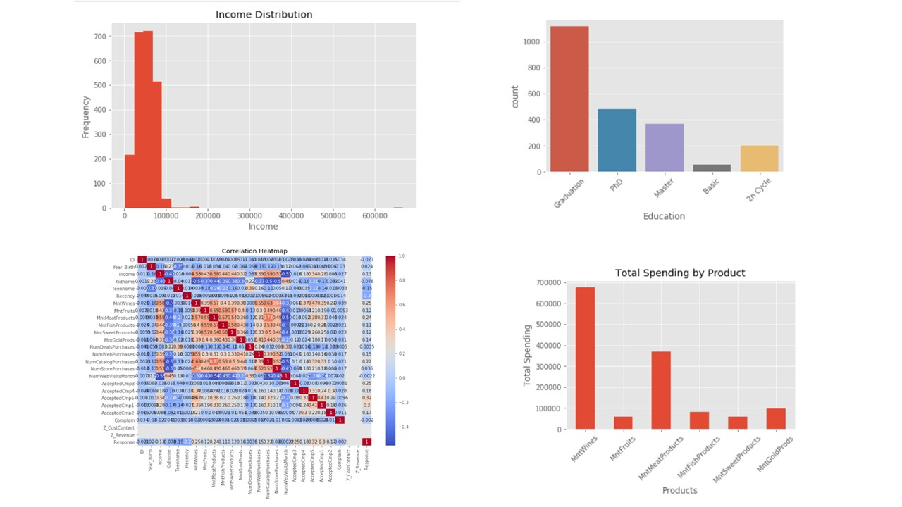

# Customer Personality Analysis - Exploratory Data Analysis (EDA)

## Project Overview

This project performs Exploratory Data Analysis (EDA) on the Customer Personality Analysis dataset using Python. The objective is to understand customer demographics, income distribution, purchasing behavior, and product preferences through statistical analysis and data visualization.

## Tools & Technologies

- Python
- Jupyter Notebook
- Pandas
- NumPy
- Matplotlib
- Seaborn

## Dataset

Customer Personality Analysis Dataset

## Project Workflow

1. Import Libraries
2. Load Dataset
3. Data Cleaning
4. Exploratory Data Analysis (EDA)
5. Univariate Analysis
6. Bivariate Analysis
7. Correlation Analysis
8. Product Spending Analysis
9. Business Insights
10. Conclusion

## Visualizations

- Year of Birth Distribution
- Income Distribution
- Education Distribution
- Marital Status Distribution
- Income vs Wine Spending
- Income by Education
- Correlation Heatmap
- Total Spending by Product

## Key Insights

- Most customers belong to the Graduation education category.
- Married customers represent the largest customer group.
- Higher-income customers tend to spend more on wine products.
- Wine products have the highest overall spending.
- Meat products are the second-highest spending category.
- Customer income positively influences purchasing behavior.

## Project Preview

## Conclusion

The analysis provides valuable insights into customer demographics, spending behavior, and purchasing patterns. These findings can help businesses improve customer segmentation, targeted marketing, and strategic decision-making.

## Author

**Enjerla Priyanka Roshni**