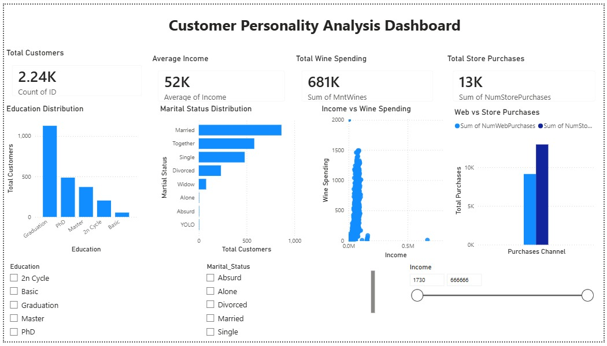

# Customer Personality Analysis Dashboard

## Project Overview

This project presents an interactive Power BI dashboard built using the Customer Personality Analysis dataset. The dashboard analyzes customer demographics, income, spending behavior, and purchasing patterns to generate business insights.

## Tools Used

- Power BI Desktop
- Microsoft Excel / CSV
- Data Visualization

## Dashboard Features

- Total Customers KPI
- Average Income KPI
- Total Wine Spending KPI
- Total Store Purchases KPI
- Education Distribution
- Marital Status Distribution
- Income vs Wine Spending
- Web vs Store Purchases
- Interactive Slicers

## Business Insights

- Graduation is the most common education level.
- Married customers form the largest customer group.
- Higher-income customers tend to spend more on wine products.
- Store purchases are higher than web purchases.
- Customer demographics influence purchasing behavior.

## Dashboard Preview

## Author

**Enjerla Priyanka Roshni**
